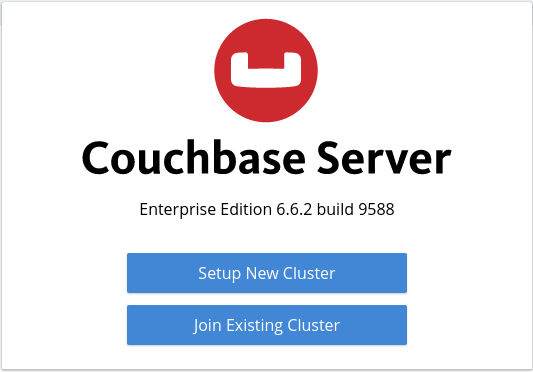
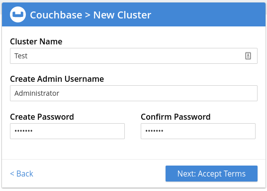
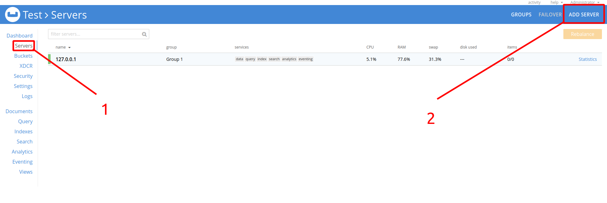
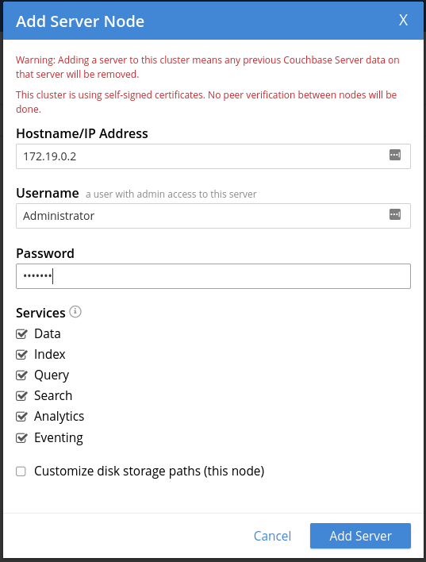
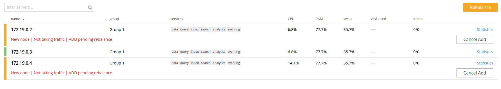

I will be creating a 3 node cluster using docker

To run I wrote docker-compose.yml

```
$ docker-compose up -d --scale db=2 
Creating couchbase_db_1     ... done
Creating couchbase_db_2     ... done
Creating couchbase_master_1 ... done


```

We will connect two of our clusters to the master. To do this, we need to know their ip address.
```
$ docker inspect -f '{{range .NetworkSettings.Networks}}{{.IPAddress}}{{end}}' couchbase_db_1
172.19.0.2
$ docker inspect -f '{{range .NetworkSettings.Networks}}{{.IPAddress}}{{end}}' couchbase_db_2
172.19.0.4

```

Now we can connect to master via http: // localhost: 8091



Here we create a new cluster



We pass to the main screen. Go to the Servers tab and add a new server.



We repeat the operation twice for two nodes.



And we can press Rebalance


